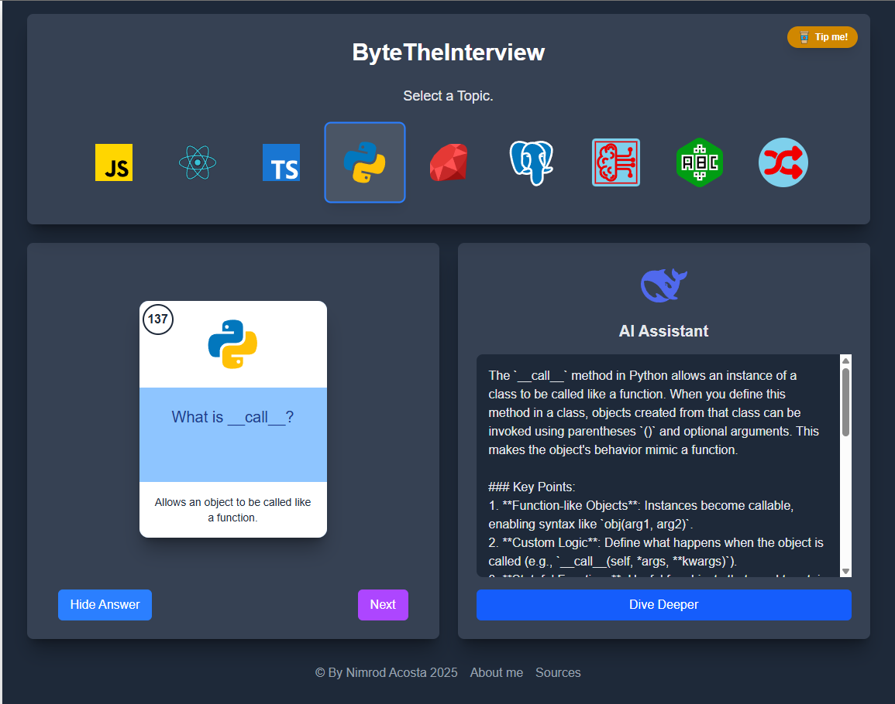

# ByteTheInterview

This is a practical application designed to improve your performance in programming job interviews, especially the theoretical part.

It's a Flaskcards application that allows you to memorize short and concise answers to the most common industry questions in languages ​​like JavaScript, Python, Ruby, Machine Learning, Databases, and those deadly acronyms we always forget.

It also has AI integration in case you want to delve a little deeper into a specific question.

## Built With


## 🛠️ Technologies Used

- **Frontend**: Next.js, TypeScript, Tailwind CSS, React
- **AI Provider**: OpenRouter (DeepSeek models)
- **Hosting**: Netlify

## live

https://bytetheinterview.netlify.app/

# ByteTheInterview - AI-Powered Technical Interview Prep

<div align="center">
  
  <p><em>AI-powered platform for technical interview preparation</em></p>
</div>

## ✨ Features

- 🚀 **DeepSeek AI Integration**: Get accurate technical answers powered by DeepSeek's advanced models
- 💡 **Expert-Level Explanations**: Clear, concise responses tailored for technical interviews
- 🔍 **Topic-Focused**: Search by specific technologies and concepts
- ⚡ **Fast & Intuitive**: Clean interface optimized for quick learning

## 🚀 Getting Started

### Prerequisites

- Node.js (v18+ recommended)
- npm or yarn
- OpenRouter API key

### Installation

```bash
git clone https://github.com/yourusername/bytetheinterview.git
cd bytetheinterview
npm install
```

## Author

👤 ** Nimrod Acosta **

- GitHub: [nimplay](https://github.com/nimplay)

- LinkedIn: [nimrod-acosta](https://www.linkedin.com/in/nimrod-acosta)

## 🤝 Contributing

Contributions, issues, and feature requests are welcome!
Feel free to check the [issues page](../../issues/).

## Show your support

Give a ⭐️ if you like this project!


<a href='https://ko-fi.com/Y8Y8WZR9' target='_blank'></a>

## 📝 License

This project is [MIT](./LICENSE) licensed.# README

